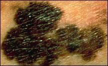

# Melanoma: Understanding a Dangerous Type of Skin Cancer

For this blog, I chose to research melanoma, a type of skin cancer that begins in melanocytes. Melanocytes are the cells that produce melanin, the pigment that gives our skin its color. I chose melanoma because skin cancer is extremely common, and melanoma can become especially dangerous if it spreads to other parts of the body.

## How Common Is Melanoma?

Melanoma makes up only about 1% of skin cancers, but it causes a large portion of skin cancer deaths. According to the American Cancer Society, about 112,000 new cases of invasive melanoma are expected to be diagnosed in the United States in 2026. About 8,510 people are expected to die from melanoma in 2026.

Risk also changes with age and sex. The average age when melanoma is diagnosed is about 67 years old, although younger people can develop it as well. Before age 50, melanoma is more common in women, while after age 50 it becomes more common in men.

## How Is Melanoma Detected?

{: [.img-responsive](https://www.cancer.gov/types/skin/melanoma-photos) }

Melanoma is often first noticed because of a new or changing mole or spot on the skin. One common method for recognizing a suspicious mole is the ABCDE rule:

A – Asymmetry: One half of the mole does not match the other.

B – Border: The edges are irregular, blurred, or jagged.

C – Color: The mole contains different or uneven colors.

D – Diameter: The spot may be larger than about 6 millimeters, although melanomas can also be smaller.

E – Evolving: The mole changes in its size, shape, color, or appearance over time.

If a doctor thinks a spot could be melanoma, a biopsy is performed. This means that some or all of the suspicious tissue is removed and examined under a microscope by a pathologist. A biopsy is needed to confirm whether the cells are cancerous.

## What Increases the Risk of Melanoma?

One of the most important risk factors for melanoma is exposure to ultraviolet (UV) radiation. UV radiation can come from sunlight as well as tanning beds. Too much UV exposure can damage the DNA inside skin cells and contribute to cancer development.

Other factors that can increase someone's risk include having lighter skin, skin that burns or freckles easily, a history of sunburns or tanning, having many or unusual moles, having a personal or family history of skin cancer, and being older. However, melanoma can occur in people of any skin color.

## How Is Melanoma Staged?

Melanoma is generally divided into Stages 0 through IV.

Stage 0: The abnormal cells are only in the outermost layer of the skin. This is also called melanoma in situ.

Stages I and II: The melanoma has grown into the skin but has not spread to distant parts of the body. Features such as the tumor's thickness and ulceration help determine the exact stage.

Stage III: The cancer has spread to nearby lymph nodes or nearby areas of skin.

Stage IV: The melanoma has spread to distant parts of the body, such as other organs.

Doctors commonly use the TNM staging system, which considers the primary tumor, whether nearby lymph nodes contain cancer, and whether the cancer has metastasized to distant areas.

## What Treatments Are Available?

Treatment depends heavily on how advanced the melanoma is. Surgery is the main treatment for melanoma that can be completely removed. Doctors usually remove the melanoma along with some normal-looking skin surrounding it.

For melanoma that has a greater chance of returning or has spread, treatment may also include immunotherapy. Immunotherapy helps the patient's immune system recognize and attack cancer cells. Drugs such as pembrolizumab may be used in certain patients.

Some melanomas contain specific genetic mutations that allow doctors to use targeted therapy. These treatments target particular molecules or pathways that help the cancer cells grow. Treatment options for advanced melanoma can therefore depend on both the stage of the cancer and the biological characteristics of the tumor.

## Life Expectancy and Survival

There is not one specific life expectancy for everyone with melanoma because survival depends greatly on how early the cancer is discovered. Instead, doctors often describe prognosis using 5-year relative survival rates.

According to the American Cancer Society, the 5-year relative survival rate is:

Localized melanoma: greater than 99%

Regional melanoma: about 76%

Distant melanoma: about 36%

All stages combined: about 95%

These numbers show why early detection is so important. When melanoma is found before it has spread, the outlook is extremely good. Once it spreads to distant organs, it becomes much more difficult to treat. Survival statistics are also averages and cannot predict exactly what will happen to an individual patient.

## Final Thoughts

Researching melanoma showed me how important both prevention and early detection can be in cancer. Something as simple as noticing that a mole is changing could potentially lead to an earlier diagnosis and a much better outcome. Melanoma also shows how cancer treatment is becoming more personalized. Doctors can consider the stage and molecular characteristics of a patient's cancer when deciding which treatments may work best.
